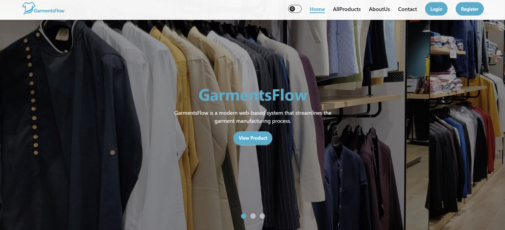

# Garments Order & Production Tracker System



---

## Table of Contents
- Project Overview
- Live Demo
- Repositories
- Technologies Used
- Features
- Dashboard Overview
- Getting Started
- Environment Variables
- Why This Project?

---

## Project Overview
The **Garments Order & Production Tracker System** is a web-based platform designed for small and medium-sized garment factories to efficiently manage their production workflow.

The system helps track buyer orders, monitor inventory, manage production stages (cutting, sewing, finishing), and ensure timely delivery with real-time updates.

It supports **role-based access** for **Admin**, **Manager**, and **Buyer**, ensuring secure and organized operations.

---

## Live Demo
🔗 https://garments-order-tracker.netlify.app

---

## Repositories

### Client Repository
🔗 https://github.com/Jobayer561/garments-order-production-tracker-client.git

### Server Repository
🔗 https://github.com/Jobayer561/garments-order-production-tracker-server.git

---

## Technologies Used

### Frontend
- React.js
- Tailwind CSS
- DaisyUI
- Framer Motion
- Headless UI
- React Router
- React Hook Form
- Axios

### Backend
- Node.js
- Express.js
- MongoDB

### Authentication & Payment
- Firebase Authentication
- JWT
- Stripe Payment Gateway

### Deployment
- Netlify (Frontend)
- Vercel (Backend)

---

## Features

### General
- Fully responsive modern UI
- Smooth animations using Framer Motion
- Secure role-based authentication
- MongoDB-powered backend
- Toast notifications
- Global error handling and 404 page
- Dark / Light mode toggle

---

### Home Page
- Hero banner with CTA
- Featured products (MongoDB data)
- How it works section
- Customer feedback carousel
- Two additional custom sections

---

### Authentication
- Email & password login
- Google authentication
- Role selection (Buyer / Manager)
- Pending approval system
- Password validation rules

---

### Products
- Product listing with image, price, category
- Product details page (private route)
- Order booking form with validation
- Payment via Stripe or Cash on Delivery
- Order saved in database

---

### Admin Dashboard
- Manage users (role update, suspend with reason)
- Manage all products
- View and filter all orders
- Analytics-ready dashboard structure

---

### Manager Dashboard
- Add and manage products
- Approve or reject orders
- Update production & shipping status
- Profile management

---

### Buyer Dashboard
- View personal orders
- Cancel pending orders
- Track order progress
- Profile view with suspend feedback

---

## Dashboard Overview

| Role    | Access Pages |
|--------|-------------|
| Admin  | Manage Users, All Products, All Orders |
| Manager | Add Products, Manage Products, Pending Orders, Profile |
| Buyer  | My Orders, Track Orders, Profile |

---

## Getting Started

Follow these steps to run the project locally.

---

### Prerequisites
Make sure you have:
- Node.js (v18+)
- npm
- MongoDB (Local or Atlas)

---

### Client Setup

```bash
git clone https://github.com/Jobayer561/garments-order-production-tracker-client.git
cd frontend
npm install
npm run dev
